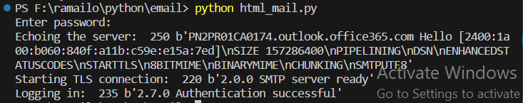

<h1>Sending Email through outlook server using text and html file</h1>

<h2>Sending text mail</h2>

The message is a string created in the program

<h3>Output</h3>

<h2>Sending  html file as a mail</h2>
<h3>Output</h3>

